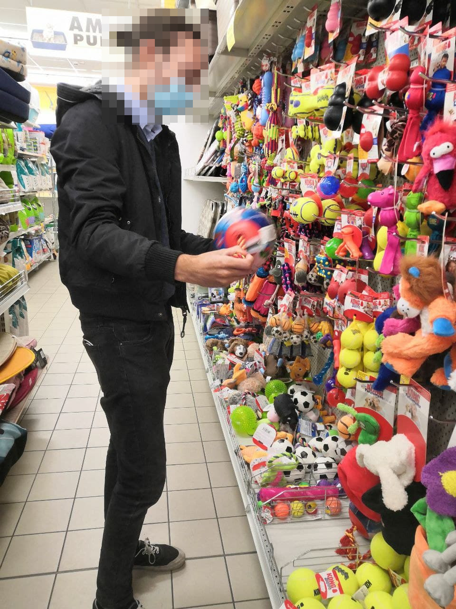

# Milestone 1: Project description and Needfinding: DOoGle

## Overview and planning

The original project idea was about lending dog owners some help in taking care of their dogs' needs.
Specifically, the activity that we observed consisted in dog owners entering a pet shop and buying a variety of products for their dogs, since this is a very important aspect of the well-being of the dog.
Our target users are:
1. Dog owners, whose relevant characteristics for us are:
    * Experienced/Novice
    * Has an adult dog/a puppy 
    
    It may also be interesting to differentiate owners based on their dogs' size, in order to understand if this attribute affects in some ways the shopping.
2. Pet shop employees, which have valuable experience and information that may give us interesting insights on the purchasing process.

Ideally, targeted users should cover all possible figures (experienced owner, novice owner, adult dog, puppy) so that the answers will be as much heterogeneous as possible, to better understand our users' needs. For this reason, it may be useful to discard some users a priori.

## Observation

1. (Novice dog owner, adult dog, small size) The owner enters the pet shop with his dog, and weigths her on a scale, then proceeds to the food department, where he goes right for the kind of product he has in mind. He, then, enters the toys department and, using his dog's feedback, chooses a toy. Specifically, he lets her smell the different items present there in order to choose what she likes the most. Lastly, when he reaches the checkout, he is met by some employees he knows, who give some treats to the dog and pet it a bit. Then, he buys some prize-treats too and proceeds to the payment.

  
  

  <i>Letting the dog choose a toy can improve its enjoyment and reduce the amount of time spent on the choice.</i>

2. (Novice dog owner, puppy dog, big size) The owner enters the pet shop and, like the previous one, walks directly into the food department. Here, he stops to read the different descriptions written on the packages, with a preference for big-sized ones. After some time, he leaves the department without having selected any item and proceeds towards the toys department. Once there, he starts touching different toys, checking their material and label. In the end, he takes a tennis ball and goes to the checkout to pay.

  
  

<i>Since the dog is not present during the shopping, his owner has some trouble in choosing a toy, so he has to check the various toys in order to choose the most suitable one to buy for the dog.</i>

3. (Experienced dog owner, adult dog, medium size) The couple enters the shop and goes straight to the food department. They are sure about the food they intend to pick: rabbit flavored canned meat, but they are not sure about the quantity, so they spend some time to decide. They decide to pick plenty, so they won't have to come back too soon.

  
  

<i>Sometimes dog owners find it difficult to decide about the quantity of food to buy in one single time.</i>

4. (Experienced dog owner, adult dog, small size) A man and his daughter, along with their dog, enter the pet shop and go to the food department, after quite some time they leave the department without having found what they were looking for. The next stop is the toys section. Here, they again take their time to decide which toy to get for the dog, who is not really involved in the choice. Ultimately, they go near the checkout where they find and take a dental care kit for the dog and some products to use to clean the floor.

  

<i>Some people don't have a clear idea about what they will buy, so lot of time is spent on the matter.</i>

### Interviews

We proposed one specific interview to a pet shop employee (in order to have some insights about the shopping process of the customers).

The questions asked to the employee were:
* What are the main concerns of the customers when they come and ask for your help? -> Some people ask for advice to their vet, and so they are already sure about what to buy, while some others trust the employees and follow their advice. The most frequent problems that customers seem to have, are about their pet's feeding habits: it appears that their dogs show a tendency to dislike some types of food. The employee suggests that this may not be a real problem, but it is rather related to the fact that some dogs are, in his words, 'picky'.
* Which kind of advice do unexperienced dog owners seek? -> They often come without any idea about what to buy or do for their dogs, so they really depend on staff members' advice.
* Do novice dog owners ask the same kind of questions of people with more experience or do they differ significantly? -> People with some previous knowledge often need less help, since they already had some experience.
* Have you noticed some common/exclusive aspects about the shopping habits of dog owners? If so, can you tell us more about them? -> The employee confirmed the tendency of the dog doing the actual choosing of a toy or snack, that emerged in our observations.
* Can you distinguish some categories of customers, based on their shopping behaviours? -> He noticed that most of their customers do not care about the pricing aspect of the products they buy if they are valuable, and follow the advice regardless of the price.

Focusing, instead, on the interviews proposed to the same observed dog owners, we asked these questions and we obtained the following answers:
- How old is the dog? Was him/her your first dog? -> We found a quite heterogeneous target group for our observations and interviews, as we can see from the labels in the "Observation" section, managing to cover all the figures we highlighted in the overview. 
- What do you generally buy besides what you have bought today? -> Food and toys, with occasional purchases of kennel, blankets, a leash and reward-treats.
- When you come to the pet shop, do you already have clear in mind what to buy or do you decide on the spot? -> Most of the people arrive at the shop with a clear picture in mind of what to buy, but sometimes they also like to get 'inspiration' from what they see on the spot and buy something different or something in addition to what they originally planned.
- Do you always like buying products to which the dog is used to or do you change sometimes? -> Food-wise they tend not to vary much.
   - Why? -> Just out of habit...
   - Is there any particular reason? -> ...or because an expert (e.g. their vet) suggested a specific product, sometimes also due to some dog health issues.
- (For experienced dog owners) Do you give some recommendations to other people? -> Many of them like to give advice to other people, when they find the opportunity to do so.
   - (If the answer was "yes") What would make you recommend an item over another? -> The good quality of a product.
- When you buy something which are the aspects that you pay more attention to? -> The selection criteria for the food is usually the composition and the ingredients, often due to some health issues or some specific diet of the dog. In toys and items they tend to appreciate the quality of the materials. Overall, the quality-price ratio is a recurring aspect across our interviews.
   - Can you make an example of what [the aspect the person highlighted] is in some pet-related products you are familiar with? -> [quality of the materials] Mainly durability, given how some dogs are inclined to easily break toys.
- Before buying something, do you gather information about the products? -> Yes, the observed users gather information from other people and/or from Internet.
   - (If they don't mention Internet) Do you also search on the Internet? -> Yes, almost all of them.
      - Why? -> It's useful because there are a lot of information, but they underlined the fact that they need to pay attention to what they read.
    - (If they also use Internet) In general, do you prefer advice from people that you know or reviews from the web? -> Mainly reviews from the web.
- (For experienced dog owners) How did you choose what to buy for your pet when you were still unexperienced? -> Their first information about what to buy came from experts, like their vet: practically nobody learnt on their own from the start.
- (For experienced dog owners) During the growth of the dog, have your purchase habits changed? -> Yes.
   - (If the answer was "yes") In which way? -> Mostly due to health problems of the dog, so they needed to opt for particular products.
- Talking about goods, what were the most challenging aspects of understanding your pet's needs? -> The most difficult aspect to comprehend when making purchases seems to be a specific and peculiar characteristic of each dog, which makes it difficult to escape the "trial and error" process without having to rely on some expert, probably because they did not have other people in similar situations to confront with.

## User Needs
1. Dog owners often find themselves spending a lot of time deciding the products to buy when at the pet shop. They may need some help and/or additional information about the products they can find in a store, to help them reduce their general indecision.
2. Novice dog owners have very little clue about what they should do or buy for their new dog. They may need something to be able to compensate for their very poor knowledge about the fundamental things to buy.
3. Dog owners need a way to select the proper kind of food depending on the dog, since they often find it difficult.
4. Dog owners need a way to easily compare the price of a given food in different shops to find the most convenient one, since this is an aspect they often care about.
5. Most dog owners take very in consideration the opinion of an expert (like a vet, for example), and a good part of them seems to trust advice from people they know or even found on the internet, if the same advice is repeated multiple times. They need a way to easily obtain a lot of advice from experts (vet, shop employees, other experienced owners).

## Project Description
Our project will address the problems regarding the lack of knowledge of novice dog owners (need #2) and the need of being able to easily find a good amount of opinions and advice, being them from an expert person (vet or pet shop assistant) or from other people (need #5).  
A possible strategy to adopt can be the creation of a system through which the users can publish suggestions and/or questions, read them when they're written by other users,  with the possibility to comment and/or highlight the most useful ones, also prioritizing those that come from an expert figure. This system will also be integrated with a small guide containing the most important and basic knowledge that novice dog owners should be aware of about various topics.  
The main target device will be the smartphone, since it is more available to users in any circumstance, and thus our system could be accessed just before entering the pet shop or even inside it, to find the right advice and better perform their shopping activity.  
