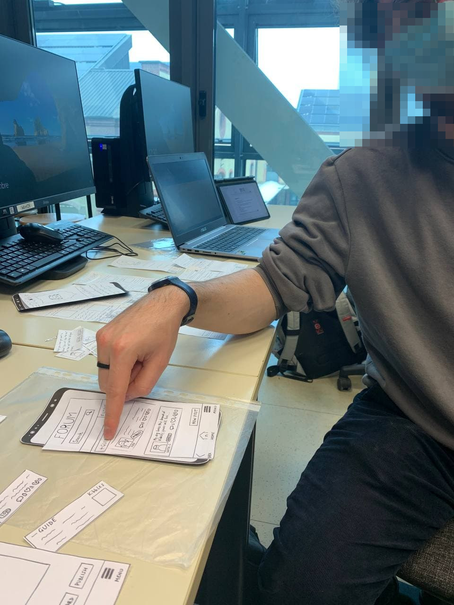

# Milestone 2: Prototyping and Heuristics - DOoGle

## Storyboards 
The proposed storyboard is:

  

In the top row of the storyboard we represented a person who has just adopted a dog and is now experiencing some issues in understanding what to buy because he/she has no previous experience with dogs. Then, he/she will check DOoGle's guide to grasp the basics of how to take care of its dog.  
In the bottom row, instead, we represented the same person who is having troubles in making his/her dog wear a harness. After struggling for some time, he/she reads suggestions about it coming from other people, which at the end prove to be helpful.  
In both cases the identified user needs are completely satisfied.  
So, we chose this storyboard because it well depicts two of the possible situations in which a user may take advantage of what will be the result of our project: a novice dog owner that needs help on the basics of how to take care of its dog, a dog owner (novice, in the case of the storyboard, but not necessarily) who needs advice from other people.  
Its strength is, for sure, the linearity, which makes it easy to understand. It is also good at representing different modes of interaction (check the guide for information, interact with other users by creating new posts).  
No weaknesses have been observed, since the storyboard is fully capable of representing the perspective of the user.

## Paper Prototypes

Both prototypes assume the user is already registered and logged in, so that the focus can be on the main features needed to satisfy users' needs.

### Prototype #1

  

  <i>This picture shows the flow of transition between the initial screen and the menu screen. The left screen is the initial screen, presented to the user after opening the DOoGle app. By tapping on the <b>hamburger icon</b> on the top-left corner of the screen, a menu screen will open (the screen on the right). This screen contains user info and will allow the user to change settings, see help/documentation and/or access his/her posts published on the Forum section. From this second screen, both the <b>"back" icon</b> (in the top-left corner) or the <b>"HOME" icon</b> (on the rigth in the bottom navbar) can be tapped to return to the initial screen of the app.</i>

  

  <i>This picture shows the flow of exploring the guide provided in the DOoGle app. From the initial screen, tapping on the <b>"GUIDE" icon</b> will show the Guide screen (the second screen on the left). From here, a series of category boxes is presented. By choosing a category box and tapping on it (e.g. the <b>"Food" box</b>), the corresponding screen will open. In this new screen (the second screen on the right), a second series of boxes will present some topics that are included in the more general one (e.g. "Kibble" under "Food"). By tapping on one of these boxes (e.g. the <b>"Kibble" box</b>) the actual guide page will open (the right-most one), containing a detailed descrpition of the topic and some pictures. At any stage of this navigation flow, tapping on the <b>"back" icon</b> (in the top-left corner) will bring back to the previous screen (until the initial screen is reached), and tapping on the <b>"GUIDE" icon</b> in the bottom navbar (the second icon on the left) will bring back to the main screen of the Guide section (the second screen on the left). The <b>"MENU" hamburger icon</b> in the bottom navbar (the left-most one) and the <b>"HOME"</b> icon (the right-most one) serve the same purpose as in the previous flow of navigation.</i>

  

  <i>This picture shows the flow of exploring the content of the forum provided in the DOoGle app. From the initial screen, tapping on the <b>"FORUM" icon</b> will show the Forum screen (the second screen from the left). Here, a series of posts from the users of the app is presented, each one with an extract of its content, the list of associated tags and the number of comments, likes and dislikes. The entire list of posts can be filtered, to show only a part of it, according to some criteria. This can be done by tapping the <b>"Filters" button</b>, which will open a popup (in the second screen from the right) where some filter can be applied (e.g. selecting only posts with some specific tags, or sorting the resulting posts with some specific criterion). Tapping the <b>"CANCEL" button</b> will undo all the changes and restore filters that have already been chosen before opening the popup, while tapping the <b>"APPLY" button</b> will confirm the choices and apply the filters to the current list of posts, showing the results accordingly (e.g. by applying the "Kibble" filter, only the posts with the "Kibble" tag remain, in the right-most screen). A filter can be individually removed by tapping the <b>"x"</b> near its name, in the bar on the left of the Filters button, and this will change the displayed posts according to the remaining filters. The filtered list of posts can also be directly reached from the Guide section, when tapping on the link at the end of a specific Guide page, which will bring to the Forum section and automatically apply the corresponding filter (e.g. coming from the Kibble guide page, the "Kibble" filter will automatically be applied). At any stage of this navigation flow, tapping on the <b>"back" icon</b> (in the top-left corner) will bring back to the previous screen (until the initial screen is reached), and tapping on the <b>"FORUM" icon</b> in the bottom navbar (the second icon on the right) will bring back to the main screen of the Forum section (the second screen from the left), with no filters applied. The <b>"MENU" hamburger icon</b> in the bottom navbar (the left-most one), the <b>"HOME"</b> icon (the right-most one) and the <b>"GUIDE icon</b> (the second icon on the left) serve the same purpose as in the previous flows of navigation.</i>

  

  

  <i>This picture shows the flow of adding a new post to the Forum section. From a Forum screen (the left-most one), regardless of any filters applied, by tapping on the <b>"NEW POST" button</b>, the post creation screen will open. Here, the user can type the content of a new post in the text field and, tapping on the <b>"ASSIGN FILTER" button</b> (the bottom-left one), a popup will open (the third screen from the left) and the user will be able to choose some tags to assign to the new post. The <b>"CANCEL" button</b> can be used to undo all the changes and restore tags that have already been chosen before opening the popup, while tapping the <b>"ASSIGN" button</b> will confirm the choices and add the corresponding tags under the text field (as shown in the third screen from the right). A tag can be individually removed by tapping the <b>"x"</b> near its name. When the user is done with adding tags to the new post, tapping on the <b>"PUBLISH" button</b> will bring back to the Forum section, always providing a feedback message (as shown in the right-most screen). The new post will be visible in this screen depending on how many posts are on the screen and the filtering criterion that was previously active. By tapping on the <b>trash icon</b> on the top-right of the item corresponding to a post published by the user, the post will be deleted. If the user does not want to publish the post, from the post creation screen it is possible to tap on the <b>"CANCEL" button</b> and a message in a popup will appear (the second screen on the right), warning the user that all the post content and the tags will be lost after leaving, asking for confirmation (tapping the <b>"YES, LEAVE" button</b>) or if the user wants to continue to edit the post (tapping the <b>"NO, STAY" button</b>). At any stage of this navigation flow, tapping on the <b>"back" icon</b> (in the top-left corner) will bring back to the previous screen (the left-most one), and all the icons in the bottom navbar will serve the same purpose as in the previous flows of navigation. However, before any of these actions will be actually performed during the creation of a post, the warning popup (the second screen on the right) will appear, asking for confirmation.</i>

  

  

  <i>This picture shows the flow of adding a comment to an existing forum post. From a Forum screen (the left-most one), the user can tap on the item corresponding to the post he/she wishes to leave a comment to, and the corresponding screen will open (the one in the middle). Here the user can see the entire content of the post, along with the author, the post's tags, the number of comments, likes and dislikes, and read all the previous comments left by other users (for each of them, the name of the comment's author and the number of likes/dislikes is shown). To leave another comment to the post, the user can select and type in the text field on the bottom of the screen, and when the comment is ready, tapping on the <b>"arrow" icon</b> on the right of the text area will add the comment to the post, showing it immediately (and updating the comments count of the original post). By tapping on the <b>trash icon</b> on the top-right of the item corresponding to a comment left by the user, the comment will be deleted. At any stage of this navigation flow, tapping on the <b>"back" icon</b> (in the top-left corner) will bring back to the previous screen (from the left-most one, the initial screen will be reached), and all the icons in the bottom navbar will serve the same purpose as in the previous flows of navigation.</i>

  

  <i>This picture shows two particular interactions that the user can perform during any of the navigation flows regarding the Forum section. The left screen shows the use of a searchbar, through which the user can insert some words and start the search by tapping the <b>"magnifying lens" icon</b>, in order to view only the posts containing a particular word inside their content (e.g. the search for "loves" will show only the posts in which the word can be found, highlighting it inside of their text). By tapping on the <b>"x"</b> icon the content of the searchbar is emptied. The right screen shows a way of interacting with the posts left by other users, by tapping on the <b>"like"</b> or <b>"dislike" icons</b> inside the items representing a post. This action will increase the corresponding counter (e.g. after the "dislike" reaction is left by the user, the counter grows from 0 to 1). Tapping again on the same icon will remove the reaction, decreasing the counter.</i>

  
  
### Prototype #2

  

  <i>This picture shows the flow of transition between the initial screen and the menu screen. The left-most screen is the initial screen, presented to the user after opening the DOoGle app. By tapping on the <b>hamburger icon</b> on the top-left corner of the screen, a menu screen will open (the screen on the right). This screen contains user info and will allow the user to change settings, see help/documentation and/or access his/her posts published on the Forum section. From this second screen, both the <b>"BACK" icon</b> (the left-most icon of the bottom navbar) and the <b>"HOME" icon</b> (the one in the middle of the bottom navbar) can be tapped to return to the initial screen of the app.</i>

  

  <i>This picture shows the flow of exploring the topics presented by the DOoGle app, reaching a useful guide and some Forum posts regarding a particular topic. The initial screen (the left-most one), presents a series of external circular icons, representing some categories that can be explored in the app. By choosing one of them (e.g. the <b>"FOOD" icon</b>), the corresponding screen will open. In this new screen (the second screen from the left), a series of boxes will present some topics that are included in the more general one (e.g. "Kibble" under "Food"). By tapping on one of these boxes (e.g. the "Kibble" box), the Forum section of the app will be reached, with a pre-set filter corresponding to the chosen topic (for example the "Kibble" tag). In this new screen (the second one from the right), a special element containing a guide regarding the selected topic will be available and expanded). By tapping on the <b>"-" icon</b> or on the text "Guide" near it the guide will be reduced (as in the right-most screen), at which point it can be expanded again by tapping on the <b>"+" icon</b>. At any stage of this navigation flow, tapping on the <b>"BACK" icon</b> (the left-most icon of the bottom navbar) will bring back to the previous screen (until the initial screen is reached), the <b>"HOME" icon</b> (the one in the middle of the bottom navbar) can be tapped to return directly to the initial screen of the app and the <b>"MENU" icon</b> (the right-most icon in the bottom navbar) can be used to access the menu screen.</i>

  

  <i>This picture shows the flow of exploring the content of the forum provided in the DOoGle app. From the initial screen, tapping on the central <b>"FORUM" icon</b> will show the Forum screen (the second screen from the left). Here, a series of posts from the users of the app is presented, each one with an extract of its content, the list of associated tags and the number of comments, likes and dislikes. The entire list of posts can be filtered, to show only a part of it, according to some criteria. This can be done by tapping the <b>"Filters" button</b>, which will open a popup (in the second screen from the right) where some filter can be applied (e.g. selecting only posts with some specific tags, or sorting the resulting posts with some specific criterion). Tapping the <b>"CANCEL" button</b> will undo all the changes and restore those present before opening the popup, while tapping the <b>"APPLY" button</b> will confirm the choices and apply the filters to the current list of posts, showing the results accordingly (e.g. by applying the "Kibble" filter, only the posts with the "Kibble" tag remain, in the right-most screen). A filter can be individually removed by tapping the <b>"x"</b> near its name, in the bar on the left of the Filters button, and this will change the displayed posts according to the remaining filters. When a single filter by Category is selected, along with the resulting posts, the special element containing the Guide corresponding to the filtered topic will be added to the screen, in its unexpanded state (as in the right-most screen) and will behave in the same way as in the previous flow. At any stage of this navigation flow, both the <b>"BACK" icon</b> (the left-most icon of the bottom navbar) and the <b>"HOME" icon</b> (the one in the middle of the bottom navbar) can be tapped to return to the initial screen of the app, and the <b>"MENU" icon</b> (the right-most icon in the bottom navbar) can be used to access the menu screen.</i>

  

  

  <i>This picture shows the flow of adding a new post to the Forum section. From a Forum screen (the left-most one), regardless of any filters applied, by tapping on the <b>"NEW POST" button</b>, the post creation screen will open. Here, the user can type the content of a new post in the text field and, tapping on the <b>"ASSIGN FILTER" button</b> (the bottom-left one), a popup will open (the third screen from the left) and the user will be able to choose some tags to assign to the new post. The <b>"CANCEL" button</b> can be used to undo all the changes and restore those present before opening the popup, while tapping the <b>"ASSIGN" button</b> will confirm the choices and add the corresponding tags under the text field (as shown in the third screen from the right). A tag can be individually removed by tapping the <b>"x"</b> near its name. When the user is done with adding tags to the new post, tapping on the <b>"PUBLISH" button</b> will bring back to the Forum section, always providing a feedback message (as shown in the right-most screen). The new post will be visible in this screen depending on how many posts are on the screen and the filtering criterion that was previously active. If the user does not want to publish the post, from the post creation screen it is possible to tap on the <b>"CANCEL" button</b> and a message in a popup will appear (the second screen from the right), warning the user that all the post content and the tags will be lost after leaving, asking for confirmation (tapping the <b>"YES, LEAVE" button</b>) or if the user wants to continue to edit the post (tapping the <b>"NO, STAY" button</b>). At any stage of this navigation flow, tapping on any of the icons in the bottom navbar will serve the same purpose as in the previous flows of navigation. However, before any of these actions will be actually performed during the creation of a post, the warning popup (the second screen from the right) will appear, asking for confirmation.</i>

  

  

  <i>This picture shows the flow of adding a comment to an existing forum post. From a Forum screen (the left-most one), the user can tap on the item corresponding to the post he/she wishes to leave a comment to, and the corresponding screen will open (the one in the middle). Here the user can see the entire content of the post, along with the author, the post's tags, the number of comments, likes and dislikes, and read all the previous comments left by other users (for each of them, the name of the comment's author and the number of likes/dislikes is shown). To leave another comment to the post, the user can select and type in the text field on the bottom of the screen, and when the comment is ready, tapping on the <b>"arrow" icon</b> on the right of the text area will add the comment to the post, showing it immediately (and updating the comments count of the original post). At any stage of this navigation flow, tapping on any of the icons in the bottom navbar will serve the same purpose as in the previous flows of navigation.</i>

  

  <i>This picture shows two particular interactions that the user can perform during any of the navigation flows regarding the Forum section. The left screen shows a way of interacting with the posts left by other users, by tapping on the <b>"like"</b> or <b>"dislike" icons</b> inside the items representing a post. This action will increase the corresponding counter (e.g. after the "like" reaction is left by the user, the counter grows from 4 to 5). Tapping again on the same icon will remove the reaction, decreasing the counter. The right screen shows the use of a searchbar, through which the user can insert some words and start the search by tapping the <b>"magnifying lens" icon</b>, in order to view only the posts containing a particular word inside their content (e.g. the search for "brand" will show only the posts where the word can be found, highlighting it inside of their text).</i>

  
  
The prototypes are strictly related to the storyboard. Indeed, in the first part of the storyboard the user is checking the guide, while in the second one the user is checking the forum to read suggestions about what to do.  
Both prototypes distinguish between user and expert user, so that information can come also from expert figures, as mentioned in the project description. There will also be a way to prioritize the information that is coming from expert figures through the application of some filters. As pointed out in the project description, there is the possibility to publish both questions and suggestions; the comment section of posts aims at giving the users a way to easily interact with each other and it is useful especially for question posts, but not only. The targeted device is the smartphone, so both prototypes have been developed according to this choice as it can be seen from the photos.  
Both prototypes show the same functionalities (guide and forum), in order to satisfy the identified user needs, but significantly differ in the structure: in prototype #1, the basic idea is to keep guide and forum well separated, while in prototype #2 the goal is to "merge" them, having a forum with a small integrated guide. The two prototypes also partially differ in the navigation flow, mainly due to the different bottom navbar and initial screen.

## Heuristic Evaluation

### Preparation
For the heuristic evaluation we used:
1. the paper prototypes;
2. an introduction to the project (https://docs.google.com/document/d/1f_TEFpJb5TWXNYoVmXNBhPjFA8YeKbbMjO648Mew2G8/edit?usp=sharing), which includes also 3 tasks for the evaluators to carry out;
3. a spreadsheet (https://docs.google.com/spreadsheets/d/1A7-9iGbCoTnordyhbnStEf_ecUIeCIXgBQ4nY_yaGAA/edit?usp=sharing) where to store evaluators' feedbacks.

Furthermore, we assigned roles to the team members:
* Francesca Russo - evaluator #1;
* Matteo Moschelli - evaluator #2;
* Claudio Tancredi - facilitator;
* Andrea Martiradonna - computer.

### The evaluation
The facilitator welcomed, each at a time, the different evaluators coming from other groups (Tommaso Natta from "MusicOnDemand" as evaluator #1, Alessandro Rio from "Clothify" as evaluator #2, Luca Pezzolla from "Clothify" as evaluator #3), giving a brief introduction to the project and showing them the tasks to perform. Then, he observed and took notes of what was happening, also taking photos of relevant moments. He also helped the evaluator, when needed, so that the evaluation would not get off track.

#### Evaluator #1

  

<i>Prototype #1 The evaluator seems to appreciate the bottom navbar and its flow. Instead, the back button has practically never been used.</i>

  

<i>Prototype #2 The evaluator likes the combined design of guide and forum.</i>

#### Evaluator #2

  

<i>Prototype #1 The evaluator is testing the popup for filter assignment during the creation of a new post, saying that more information should be given to the user regarding which filters are mandatory to assign, which ones are not, how many of them should be assigned, etc.</i>

The evaluator also asks the facilitator about the possibility to modify a comment/a post and the facilitator's answer is that for conveniency reasons only the delete button has been added to the prototype, but it will surely be available in the final product.

  

<i>Prototype #2 The computer while rendering the page of the forum.</i>

#### Evaluator #3
The evaluator #3, just like the two previous ones, performed the task #3 during the execution of task #1. For the first two evaluators, it was just because they were testing the prototypes and they were not completely focused on the task to perform; in fact, the facilitator had to intervene to remind them what the task was. The third evaluator, instead, pointed out that he is used to look for existing posts about what he's interested in, before creating a new one.

At the end, all the evaluators talked to each other to provide the joint feedback.  
About the two divergent ideas of how to structure the user interface (guide and forum well separated, guide and forum merged), the evaluator #1 expressed his preference for the merged interface (prototype #2), while the other two expressed their preference for the separated interface (prototype #1), saying that the prototype #1 is easier to use and more linear.

### Results

The results are available in the spreadsheet. As we can see from the sheets of the three evaluators, the reported problems are not overlapping: this happens most of the time and it's exactly the reason why having a good number of evaluations is beneficial, since no evaluator can discover all the problems and different evaluators will probably find different issues.  

Nielsen's severity rating has been used for evaluations:  

  

The joint feedback for the first prototype is:  

  

The joint feedback for the second prototype is:  

  

Overall, it's evident that the prototype #2 has a greater number of issues to deal with: this confirms the preferences of the evaluators regarding the two divergent ideas.  
We agree with the evaluators and we think that the Prototype #1 (where the Guide and the Forum are two separate sections of the application, connected only through links in the Guide pages) could fulfill its purpose in a better way, with respect to the second prototype, so we choose to focus only on it.

## Feedback analysis and potential changes
Summarizing the results from the joint feedback:  
* no "Match between system and the real world", "Aesthetic and minimalist design", "Help users recognize, diagnose, and recover from errors", "Non-heuristic issue" problems have been discovered;
* "Consistency and standards" issues that have been pointed out seem relevant and we already had doubts about them;
* some good suggestions have been provided about "Error prevention";
* a few accelerators could help, as it can be seen from "Flexibility and efficiency of use".  

In the specific:
* Issue #1 of H1 points out the lack of a feature that we already planned of including in the final version of the app, but was left out of the paper prototypes for the sake of convenience;
* Issue #1 of H3, we will add an "add to favorites" option in the forum section, to let the users store some posts they find useful or interesting, and being able to access them later;
* Issue #1 of H4, we will improve the terminology and the basic idea will be to use filters and tags, which ARE THE SAME THING, but filters are used to filter posts in the forum page, while tags can be assigned to a post that is being created. So, the "ASSIGN FILTER" button in the post creation section will change to "ASSIGN TAGS".  
Categories and filters ARE NOT THE SAME THING, categories are just an example of possible filters, but there could be others (for example, filter by expert users only). The doubt legitimately arises because, after pressing the "Filters" button in the forum page, the popup for filters assignment does not have a "FILTERS" title, which we will add. Similarly, we will add the "TAGS" title to the popup for tags assignment in the post creation;
* Issue #2 of H4, to solve this problem we will use, in the main page, the same bottom navbar that is available in the internal pages. This makes the two big buttons "GUIDE" and "FORUM" disappear, along with the hamburger button that is in the top-left corner of the screen. The issue is fixed but, to keep the messages that were previously displayed under the "GUIDE" and "FORUM" buttons ("Basic information to help you take care of your dog!", "Need further help? Interact with other users!") and to fill a bit the page, the image of the dog will be moved a bit down and some speech bubbles will be added to it, so that the user receives some suggestions about what the different buttons will do (for example, "The guide contains basic information to help you take care of your dog!").  
Moreover, the hamburger button is not perfectly suitable for the screen it opens, since it is generally used to open a page with several settings to change. In our case, the page contains some information about the user and will probably contain some buttons to let the user easily access his/her posts, his/her favorite posts, and a button to change the settings, so it is more like a profile page. For this reason, the icon will be changed with a simple user icon and the text won't be anymore "MENU", it will be "PROFILE". We also used a vertical line in the bottom navbar to logically separate the menu from the guide, the forum and the home buttons, but now that we have a profile button it doesn't seem necessary anymore, so it will be removed;
* Issue #1 of H5 points out the lack of an important feature for error prevention that we already planned of including in the final version of the app, but was left out of the paper prototypes for the sake of convenience;
* Issue #2 of H5 points out the lack of a feature that we already planned of including in the final version of the app, but was left out of the paper prototypes for the sake of convenience;
* Issue #1 of H7, we will add, as an accelerator, the possibility to search for specific filters/tags, in the popups for applying filters or assigning tags;
* Issue #2 of H7, we will add, as an accelerator, the possibility to search for specific categories in the Guide section;
* Issue #1 of H10 points out the lack of a feature that we already planned of including in the final version of the app, but was left out of the paper prototypes for the sake of convenience.

In addition to the evaluators' feedback, we also reasoned about some other things:
* the possibility to choose a sort method in the filters popup does not seem appropriate, so we'll add another button "Sort" on the right of the existing button "Filters";
* in the pages of the guide we will provide context (for example, "Food, Kibble"). It will be useful especially for the internal pages of the guide. It has not been included in the Kibble page of prototype #1, which shows only "Kibble", just by mistake, but our intentions were clearly going on this direction;  
* since our goal was also to prioritize experts' contributions and give them more visibility, we will also add an "Up" button on the right of the dislike button. The "Up" button will allow only experts to leave a special like to posts they find more useful, so that users can understand which posts are preferred also by professionals with a strong domain knowledge.
