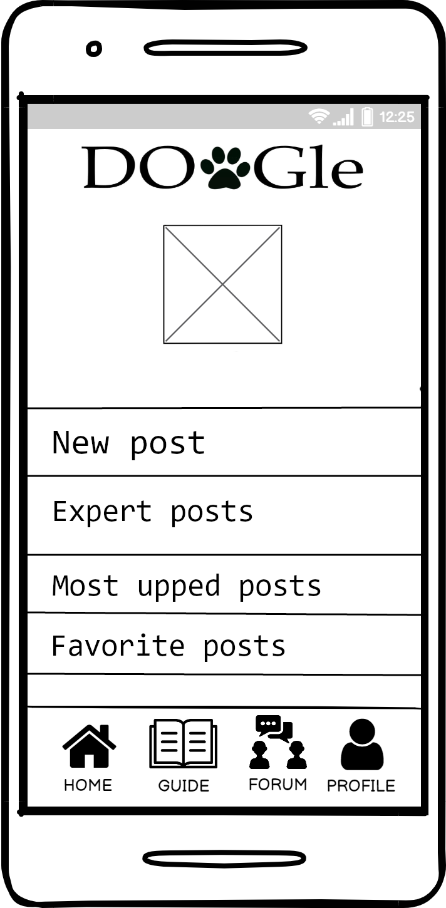
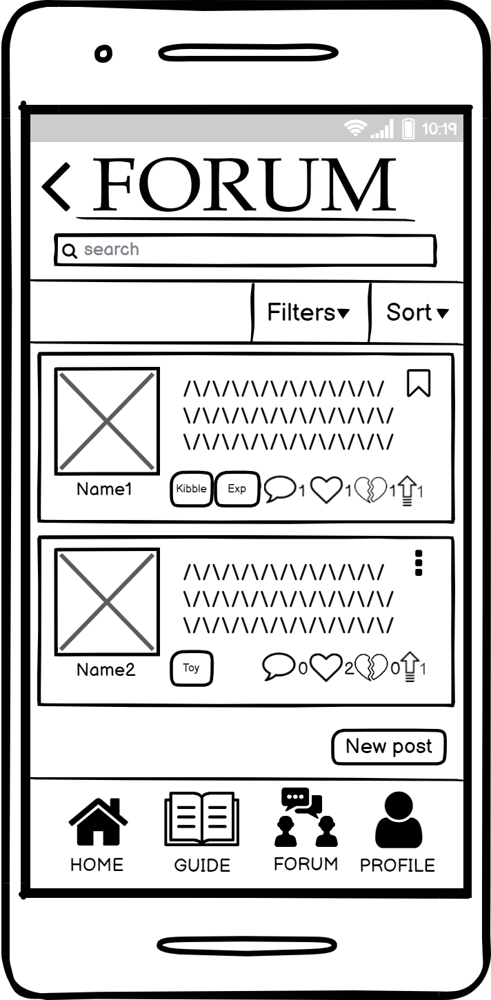

# Milestone 3: Wireframe - DOoGle

## Wireframe

Balsamiq Cloud has been used to create the two medium-fidelity digital wireframes.  
The first wireframe shows the main page of our application:  

  

As pointed by issue #2 of H4 that arised in M2, 
the position of the hamburger button, which was changing between the first screen and the other ones, was not consistent.  
As a consequence, the main page has been partially changed by employing the same bottom navbar that is in the internal pages, with the removal of the vertical line that was separating the menu button from the others.  
This also means that the two main buttons to reach the Guide and Forum sections are now reduced and included in the bottom navbar.  
In this way, the bottom navbar is always the same across the entire application and the consistency has been reinforced.  
In addition to this, we thought that using an hamburger icon (usually employed to show a contextual menu) for showing a profile page was not a right idea in terms of standards.  
So, the hamburger button has been replaced with a profile button.  
Moreover, the previous order of the navbar's buttons (from left to right: Profile, Guide, Forum, Home) was not compliant with standards that nowadays apps usually adopt (Home button on the left) and that users are already familiar with. To avoid confusion and to prevent unnecessary slips of the users we decided to switch the Profile and Home buttons' positions. This change will be applied, of course, in every section of the application.  
Since the Home page currently lacks of a "core" functionality, to further enhance the user experience and to enrich the Home page we will add some accelerators for specific actions/specific sections of the application that we think the users could benefit from, like a shortcut for the creation of a new post, and so on.
Due to the previous change, the central image has also been moved a bit and will be used as an "easter egg". When the user taps on it, a welcome message will be shown to the user and the audio of a dog that is barking will be reproduced.  

The second wireframe, instead, shows the forum page. Both the guide and the forum page are relevant in our application, but we chose to represent the forum page for two main reasons:
* it is more dynamic, since its content will change with the interaction of the user (for example sorting, filtering) or with time (the post list will change over time since more users will be adding their posts), while the guide content is static and "read-only";
* it shows more features that the user can exploit to interact with the interface, for example applying sorting or filtering critera, adding reactions to the posts, comment a post or add a new post.  

The following one is the wireframe for the forum page:  

  

As highlighted by issue #1 of H3 in M2, add to favorites functionality was missing. Also, as stated by one of the evaluators, the user should be able to edit his/her posts. This has not been included in the feedback of heuristic evaluation but it is an important feature that we need to consider.  
To address these problems, for the posts of which the user is the creator we added vertical ellipsis that will allow him/her to choose from different possible actions (e.g. to edit, delete or add to favorites one of his/her posts). Similarly, for the posts of other users we added a bookmark button, which can be used to save the post as a favorite.  
Following our reasoning at the end of M2, which did not come directly from the heuristic evaluation:  
* the sort feature has been separated from the filters and, as we said, it is now a button on the right of the filters button;
* the "Up" button has been added on the right of the dislike button, to let experts express their preferences and make them visible to all users.  

Obviously, also here the bottom navbar has changed according to what has been already said for the first wireframe.
