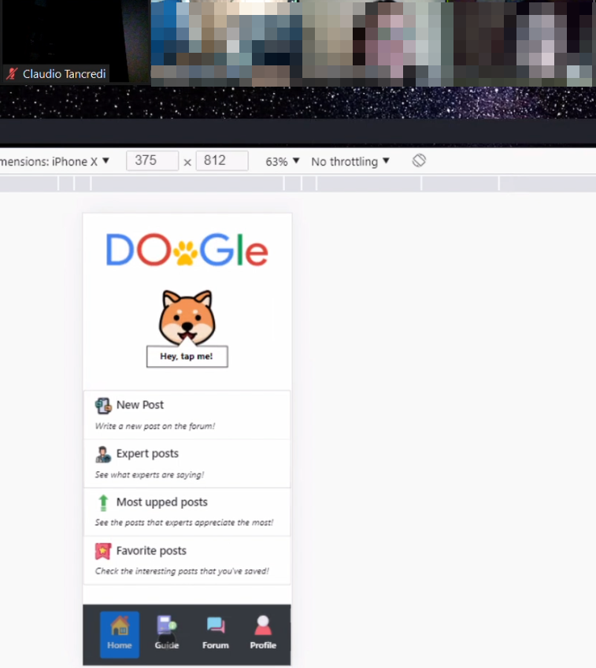
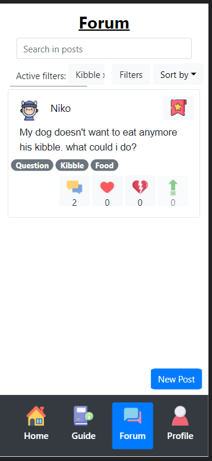

# Milestone 4: Usability Testing - DOoGle

## Overview and Script
This usability testing is going to test the perceived usability of the DOoGle application. The goal is to find usability issues by letting some real users use the application.

### Plan Overview
The purpose of this test is to evaluate the DOoGle application from the perspective of a dog owner.  
The participants will be given eight tasks to perform. For some of them, we will ask partipants to apply the think-aloud methodology.  
We will consider four metrics to evaluate tasks' success/failure: successful task completion, critical errors, non-critical errors and error-free rate.  
Then, we will summarize the results of the usability testing. Starting from the results, we will propose some changes, if usability issues occur.

### Participants 
As for the needfinding phase, the participants will be chosen by considering the target population. Our target population includes dog owners with different levels of expertise (experienced or novice) and with dogs of different ages (adult dog/puppy).  
The age of the participants is not a fixed requirement, as long as he/she is familiar with the usage of common mobile applications.  
Our chosen participants are:  
* P1, 22 years old woman with average experience with dogs, since she's the owner of two dogs, and high-average digital skills;
* P2, 30 years old man with little experience with dogs, since he recently got one, and low-average digital skills;  
* P3, 24 years old woman with high experience with dogs, since she's been the owner of two dogs for a long time, and average digital skills.  

The variety in domain and digital expertise of chosen participants will let us understand if the user interface is suited enough in different situations.

### Equipment
The equipment we are going to use to run the entire Usability Testing is the following:
- Computer on which the React application can be run, along with camera and microphone;
- Computer for the participant, along with camera and microphone (in case of a remote testing session);
- Zoom application for remote calls;
- Google Modules and Spreadsheets to collect questionnaires' answers and analyze results;
- Notebook and pens to take notes during the testing session.

### Requirements
To let the participants run the application and perform the test, we will need a fake user profile, already logged in, to test some functionalities related to the forum section.  
This fake user will not be an 'Expert' user, since our focus is on assisting dog owners that need help and expert figures are there to provide support.

### Tasks
We report in the following table the tasks we are going to present the participants, and that they will need to complete in our Usability Testing.  
Each task addresses one or more operations that can be carried out in our application, and we would like to assess if they can be easily completed, if the participants understand the interface and the actions to perform.  
The tasks that involve using the filters and tags functionalities are the ones for which we would like the participants to use the think-aloud methodology, since we want to understand if the way we present this information is clear enough to users.  

| # | Text of task | Success criteria | Methodology | 
|----|---|---|---|
| 1 | Read information about kibble in the DOoGle app  					| The user reaches the Kibble page in the Guide section. | None | 
| 2 | Read related forum posts after reading about Kibble 		| The user reaches the Forum section with the 'Kibble' filter applied, using the link from the Guide section. | None | 
| 3 | Find some useful advices about toys given by expert users 		| The user opens a post with the 'Toys' and 'Advice' tags and with the 'Expert' badge, after applying the correct filters. | Think-aloud | 
| 4 | Leave a like and a comment to the toy-advice post you appreciated the most  	| The user publishes a comment and uses the like button on a post with at least the tags 'Toys' and 'Advice'. | None | 
| 5 | Save as favorite the post you liked the most and visualize it in your favorite posts  | The user first saves a post through the correct functionality in the Forum section and then opens it in the 'Favorite posts' page of the Profile section. | Think-aloud | 
| 6 | Publish a forum post about some meaningful experience you had with your dog and tag it accordingly | The user correctly publishes a post on the Forum section, after applying the intended tags. | Think-aloud | 
| 7 | Edit the post that you created in the forum 			| The user edits one of his posts. | None | 
| 8 | Find a forum post containing a specific word 								| The user opens a Forum post containing the chosen word, after searching for it with the searchbar functionality. | None |

### Artifacts
- Screener test (Does the participant own a dog?);
- [Informed consent form](./informedconsentform.md);
- [Usability testing script](./script.md), with greetings, explanations and tasks to execute;
- Post task questionnaire - SEQ:
  - [Task #2 SEQ](https://forms.gle/TSuMffs2dukDjPDe8);
  - [Task #3 SEQ](https://forms.gle/Zk62aaS79U797RQw7);
  - [Task #5 SEQ](https://forms.gle/gypYSy7PSo9X4QVU8);
  - [Task #6 SEQ](https://forms.gle/ifwWMZV4DFz2wBmg8).
- [Post test questionnaire - SUS](https://forms.gle/UjdSfDdZRXLKbyP8A).

### Metrics
The following are the objective metrics that we are going to evaluate after the end of each task:
* Successful Task Completion, in the form of a percentage (0-100);
* Critical Errors, deviations at completion from the targets of the task, so that the participant cannot finish the task;
* Non-Critical Errors, errors that are recovered by the participant and do not result in the participant's ability to successfully complete the task;
* Error-Free Rate, the percentage of participants that have completed the task without any errors.

### Test execution and roles
All the three tests have been conducted remotely and according to the usability testing script. All the participants were given the informed consent form to sign for, and all of them agreed with its terms. For this reason, all the three tests were video-recorded. Additionally, notes were taken by the three notetakers during the remote calls.  
The assigned roles of team members are:

* Francesca Russo - facilitator;
* Matteo Moschelli - notetaker #1;
* Claudio Tancredi - notetaker #2;
* Andrea Martiradonna - notetaker #3; however, he could not participate in the Zoom calls because of health problems due to COVID-19.

Even though roles do not have to be necessarily fixed, we decided to keep always the same roles so that each of us could get accustomed to a role and better perform in subsequent calls, without switching from a role to another one and risking to adopt a different behavior that would introduce a bias in our test.  
At the end of the tests, few minutes were reserved for unstructured discussions with users, so that they could express all the comments and give all the feedbacks they wanted to share with us.  
After this, we thanked the participants and expressed our gratitude.  
Later on, we deeply discussed about the results and the discovered issues and we formalized a list of changes to be implemented in order to improve our user interface.

## Results and List of Changes
Here we report the results obtained from our usability testing, along with the feedback and issues related to each task. These will be the starting point to apply some changes to our application.  

### Results

#### TASK #1: _read information about kibble in the DOoGle app._

Metrics results:
* Successful Task Completion: 0% for P1, 0% for P2, 90% for P3
* Critical Errors: 2
* Non-Critical Errors: 1
* Error-Free Rate: 0%

  

  <i>P3 while highlighting the ambiguity of the word "Guide".</i>

All of the participants were in the home page and started reading the page content from the top to the bottom of the screen. The first thing that they noticed that could have given them information about kibble was the shortcut to expert posts on the forum, so all of them followed this path. Participants P1 and P2 used the search bar to look for “kibble” and they thought that the task was completed, while P3 was able to recover from the navigation error and opened the Kibble section of the Guide.  
Participants P2 and P3 stated that the “Guide” word was confusing, it was not clear whether the guide was intended for the application usage or as a guide to help them taking care of their dogs.  
Participant P2 also stated that he expected the dog of the home page to provide some functionality, like an help, while P3 really appreciated the dog easter egg.  

So, from this task we have learned that:
1. When users open the app for the first time, they tend to read the content starting from the top of the screen and the first things they notice are the shortcuts. As a consequence, the bottom navbar is not immediately spotted, so the user is not aware of the presence of four different sections and of the standard navigation path that the navbar should provide them with;
2. The shortcuts do not include any link to the Guide section, making its presence less evident with respect to the Forum and Profile pages, which are provided with shortcuts;
3. The “Guide” word is confusing and it often does not match the user expectation;
4. The easter egg of the dog in the home page, although appreciated, is not enough and should add a valuable functionality for the user.

#### TASK #2: _read related forum posts after reading about Kibble._

Metrics results:
* Successful Task Completion: 60% for P1, 100% for P2, 60% for P3
* Critical Errors: 0
* Non-Critical Errors: 0
* Error-Free Rate: 100%

  

  <i>P2 noticing that he has two options to get posts related to kibble: use the intended link or go to the forum and filter posts.</i>

This task was completed by all the participants, but with different degrees of success. Only P2 reached the Forum section with the filter for "Kibble" already applied using the intended shortcut, since he had the Guide section in front of him, while the other two participants went back to the Home page to start the navigation, and then to the Forum section.  
P1 applied the "Food" and "Kibble" filters by herself, while P3 tried to find the word "kibble" inside the content of the posts (they actually completed the task, but the success rate was not 100% since their actions differed from our expected route, which consists in following the link in the Guide page, like P2 did).  

A possible explanation for this divergence from the expected behaviour can be that, given the test context, the participants were not totally interested in reading carefully all the content of a Guide post, so they did not find the link at the end of the page, and instead went directly at the start to follow a path they already saw from the homepage.

In addition, for this task, a SEQ questionnaire was given to the participants. The results are:

  

P1 found the task to be of medium-difficulty, while the other two participants found the task easy to accomplish.

#### TASK #3: _find some useful advices about toys given by expert users._

Metrics results:
* Successful Task Completion: 90% for P1, 0% for P2, 60% for P3
* Critical Errors: 1
* Non-Critical Errors: 1
* Error-Free Rate: 33%

  

  <i>Context for task 3.</i>

This task highlighted some minor clarity problems with the Forum interface. Participant P3 completed the task (she reached an 'Advice' post about 'Toys' from an Expert user), but used the searchbar to find the word "toy" instead of applying filters. She was also convinced that the two buttons "Filters" and "Sort by" were part of the same functionality (i.e. that the sorting criterion was a way to apply a filter), probably because they are very near and "Filters" does not clearly resemble a button by itself.  
Another interesting feedback came from P2, since he told that he is used to first search some keyword in the contents of a long list, and then apply some filters on the search results.  
Participants P1 and P3 exploited the shortcut for Experts posts in the homepage to reach an already filtered list of posts in the Forum section.  

The issues related to this task were:  
<ol start="5">
<li> The actual functionality of the searchbar is not totally clear: it should be used to search a specific word inside the content of the posts, while it has been largely used as a filter;</li>
<li> It is not totally clear that the "Filters" and "Sort by" buttons serve two separate functions, since the first is not clearly shown as a button and seems like a label for the second one instead.</li>
</ol>

In addition, for this task, a SEQ questionnaire was given to the participants. The results are:

  

The overall consideration, although some difficulties of the participants, is that the task is easy to accomplish.

#### TASK #4: _leave a like and a comment to the toy-advice post you appreciated the most._

Metrics results:
* Successful Task Completion: 100% for P1, 100% for P2, 100% for P3
* Critical Errors: 0
* Non-Critical Errors: 0
* Error-Free Rate: 100%

  

  <i>P2 while expressing his doubts about the reactions to posts.</i>

This task was successfully completed by all the participants.  
The only minor feedback we received in this phase was from participant P2, who pointed out a little confusion he had between our 'like' icon (which he associated with a 'love' reaction) and our 'up' icon (which he thought was the right 'like' icon). He was also surprised that he could not use the 'up' button (as intended, since the logged user used for the test was not an Expert, and this functionality is exclusive to Experts), since there is not a clear indication that the functionality is unavailable for non-Expert users.  

Our conclusion was that:  
<ol start="7">
<li> It is not totally clear when the 'up' button for a post is actually unavailable and thus disabled (when the user is not Expert). </li>
</ol>

#### TASK #5: _save as favorite the post you liked the most and visualize it in your favorite posts._

Metrics results:
* Successful Task Completion: 100% for P1, 100% for P2, 100% for P3
* Critical Errors: 0
* Non-Critical Errors: 0
* Error-Free Rate: 100%

  

  <i>P1 saying that she expected the bookmark icon to be where the up button is, since she's used to Instagram.</i>

This task was successfully completed by all the participants.  
Due to employing the think-aloud methodology for this task, we were able to understand more deeply some thoughs and doubts of the participants, altough they did not impact on the final completion of the task itself:
- Participant P1 was a bit confused by the positioning of the 'save' icon, since she expected to find it where the 'up' icon is placed in our interface (like in other applications, such as Instagram).
- Participant P2 initially thought that he was not able to save a post that he wrote himself, probably because of the different icon (a vertical ellipsis) displayed instead of the 'save' icon used for posts of other users. The reason for this difference is that, for posts created by the user, there are more operations available, so a different icon is used to access them, and this will not represent an issue since with further usage of the application it is possible to clarify this doubt.
- Both participants P2 and P3 were helped by the familiar aspect of the icon used to save a post, and also by the fact that the same icon is seen in the homepage, within the shortcut for the favorite posts.

In addition, for this task, a SEQ questionnaire was given to the participants. The results are:

  

This task is considered easy to accomplish by all participants. Indeed, it was fully completed by all participants.

#### TASK #6: _publish a forum post about some meaningful experience you had with your dog and tag it accordingly._

Metrics results:
* Successful Task Completion: 90% for P1, 100% for P2, 100% for P3
* Critical Errors: 0
* Non-Critical Errors: 1
* Error-Free Rate: 66%

  

  <i>Context for task 6.</i>

This task, altough almost completely successful for all the participants, raised another possible issue regarding clarity.  
Both participants P1 and P2 reported to have been a little confused by the tagging operation. More specifically, P1 tried to insert some hashtags in the text of the post, and only after further exploring the interface came to the conclusion that the inputs below the text area were used to add tags. P2 initially thought of our tags as "topics", but then used the intended section to add the tags.  

The issue that arises from the results of this task was:
<ol start="8">  
<li>It is not totally clear that some elements of the interface (the two inputs and the related questions) are actually used to add tags to the post, since there is no direct reference to tags in those fields.
</li>
</ol>

In addition, for this task, a SEQ questionnaire was given to the participants.

  

The difficulties had by the first two participants are reflected in the answers they gave to the SEQ questionnaire. Due to the poor reference to tags, participants didn't easily find them, finding small difficulties to accomplish the task. 

#### TASK #7: _edit the post that you created in the forum._

Metrics results:
* Successful Task Completion: 100% for P1, 100% for P2, 100% for P3
* Critical Errors: 0
* Non-Critical Errors: 0
* Error-Free Rate: 100%

  

  <i>P3 found out that her posts are available in a dedicated section of the Profile page.</i>

This task was successfully completed by all the participants.  
All of them used the Edit functionality directly from the post they created in the previous task, but participant P3 has tried to reach the same page by exploring also the Profile page, thinking that there could be a section specifically for the posts created by the user.

#### TASK #8: _find a forum post containing a specific word._

Metrics results:
* Successful Task Completion: 100% for P1, 90% for P2, 100% for P3
* Critical Errors: 0
* Non-Critical Errors: 1
* Error-Free Rate: 66%

  

  <i>Context for task 8.</i>

The only minor error with this task was related to using the filter functionality instead of the searchbar. Participant P2 noticed that, applying the filter "Toys", there were no results with the specific word highlighted, as he was expecting instead, so he resorted to the searchbar to actually find a correct result, thus recovering from the mistake and making it a non-critical error.  
This may have happened for the same reason of the issue #5, since it was again unclear that the searcbar can be used to search inside the content of the posts.

### Final SUS questionnaire
Finally, a SUS questionnaire was given to the participants.

  

The average score obtained by DOoGle is 87.5, thus we can affirm that there aren't very serious usability problems according to the participants of our Usability Testing.

### Potential changes

From our analysis we extracted a list of potential changes, that we plan to implement in the final version of our prototype, in order to solve some usability problems that were highlighted during our usability test:  
* To make the meaning of the “Guide” word clear, when the user logs in for the first time he is prompted with a brief explanation of the two main functionalities of the app (the Guide and the Forum). This will solve the issue of feedback 1. and will help in solving the issue of feedback 3. ;
* The dog icon in the home page will have a different text that suggests the user to tap on it if he/she needs help, and by tapping on it the help window is prompted with information about the four different sections of the application. In this way, the easter egg is removed but the user can receive help also from the home page and not only by accessing the help page in the Profile section, which could be difficult to find at the beginning. The text of the three helps (first login, tap on the dog, help page) will be different according to the goal we want to achieve (welcome, make users aware of the functionality of the guide and make users understand the two core aspects of the application for the first login help; make the users aware of the presence of four different sections for the dog help; explain in details some key features that may be hard to grasp for the help page); this will solve the issue of feedback 4. ;
* The Guide section should be enriched with a category called “Essentials”, that includes relevant topics for novice dog owners. This category could also be accessed through a shortcut in the home page, allowing all the application's sections to have a shortcut in the home page. This will solve the issue of feedback 2. and help in solving the issue of feedback 3. ;
* To bring more clarity about the purpose of some elements of the interface, the label in the Forum searchbar will be changed to "search in posts' text", in order to solve the issue of feedback 5. ;
* To make the purpose of some elements of the post creation page clearer, a new subtitle "Add some tags to your post!"/"Edit your post's tags!" will be added in the post creation/edit page, to solve the issue in feedback 8. ;
* The filter/sort interface of the forum page will be changed in order to make a clearer distinction among the different elements and more space will be added between the two buttons. Specifically, the two buttons will be further highlighted (to show that they represent two distinct functionalities, which was not totally clear to the participants) by adding a border. This change will solve the issue raised by feedback 6. ;
* When the 'up' action is unavailable for the users (in case they are not Experts), the effect should be made clearer, in order to be immediately recognized as an unavailable action. The opacity of the button will be increased, when disabled. This change will solve the issue of feedback 7. .

In addition to these changes, which aim at solving problems emerged from the usability testing, we further reasoned about some other aspects of our interface and we decided to apply other changes:  
* The operation of removing filter is not easy when a lot of filters are already applied, requiring the user to tap on each button that represents a filter in order to remove them, one at a time. For this reason, we will add a "Clear all filters" red button where the text "Active filters:" is positioned. Obviously, the button will only be visible when at least one filter is applied, as we did with the text "Active filters:" and the filters buttons near it;
* "Active filters:" text and buttons to remove filters were not so visible, indeed usability testing participants never used them, so we will move them one row below. Moreover, we will give buttons a border and make the "x" of buttons with bold style, to better highlight it;
* The "primary" color was used both for buttons and for selected elements (navbar buttons, like, dislike, up, saved, etc.), so another color will be added to our palette. It will be used to better distinguish buttons from selected elements;
* Buttons that lead to "intended" actions of users (i.e. correspond to their goals) like "Publish", "Save changes", "Apply" (for filters), will be made green;
* Since the loading time is a bit high, especially for posts, we'll consider substituting the hash loader with a progress bar, to show users the progress of loading;
* The help page that is in the profile section will be changed into an entire page, not a minor popup, since it will contain a lot of information;
* The help on the dog will contain a link to the help page of the profile section, so that users that are not satisfied with it can get more details about our application's functionalities;
* Minor changes to texts and feedbacks.

Major changes, both emerged from usability testing and from our reasoning, have already been completed.
